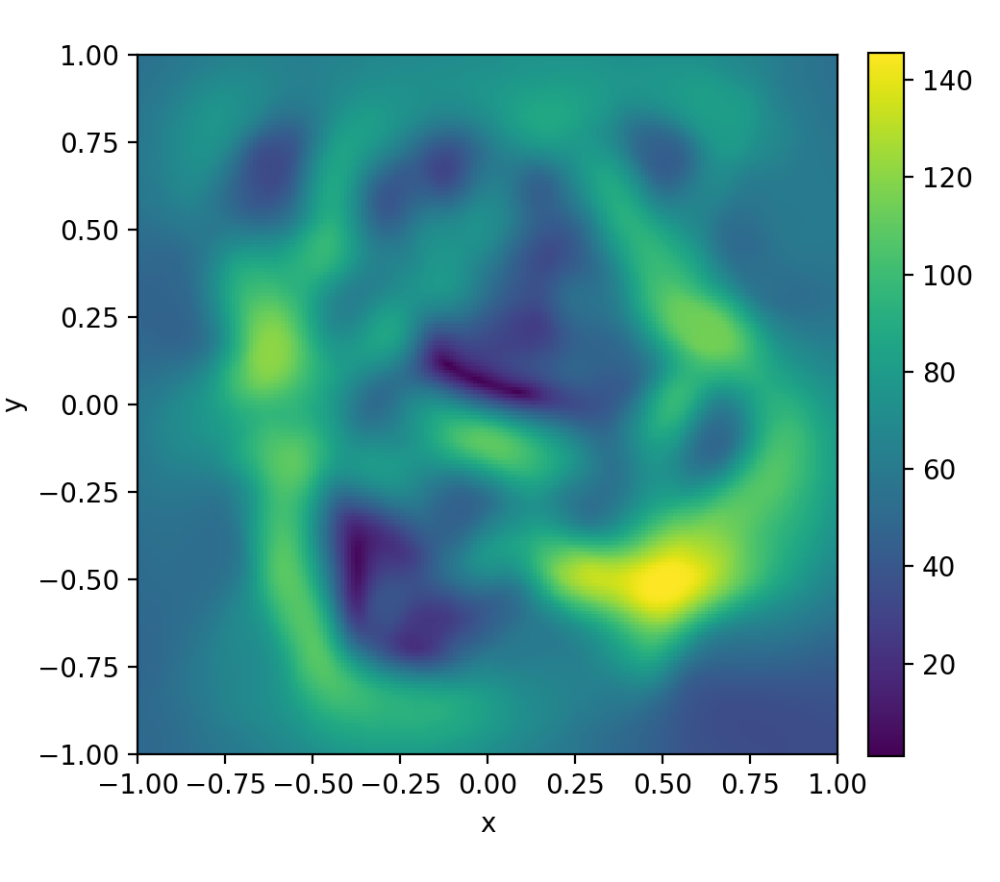
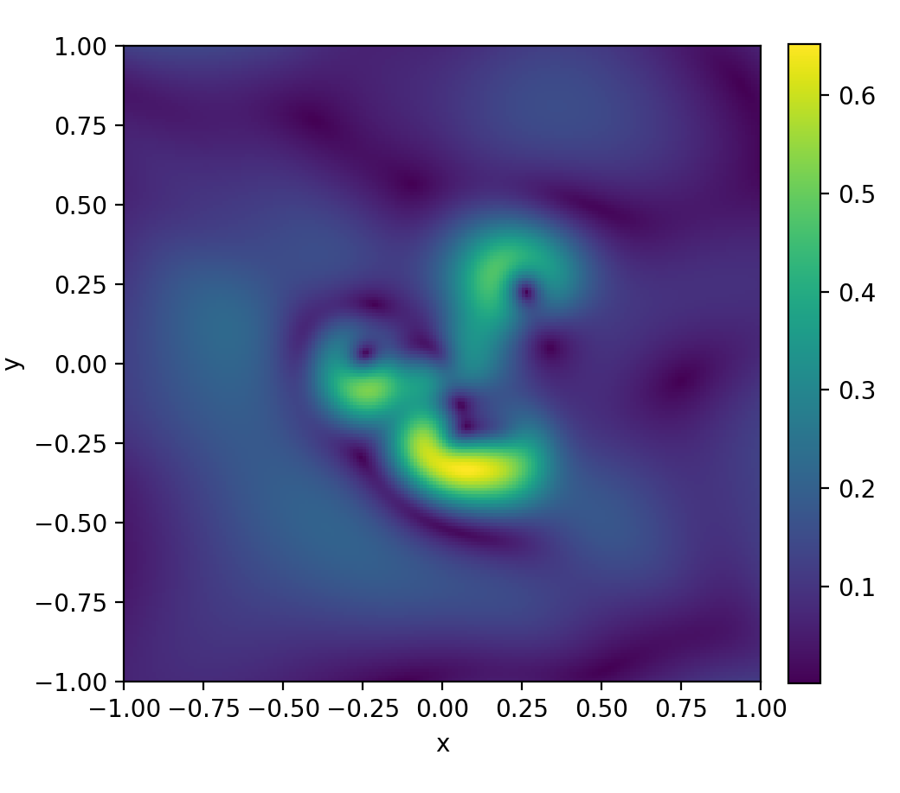
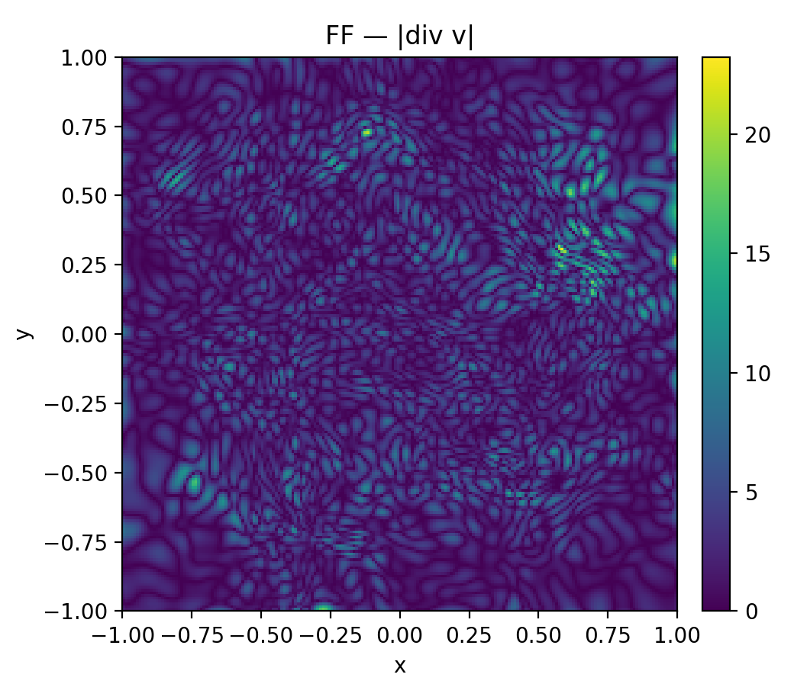
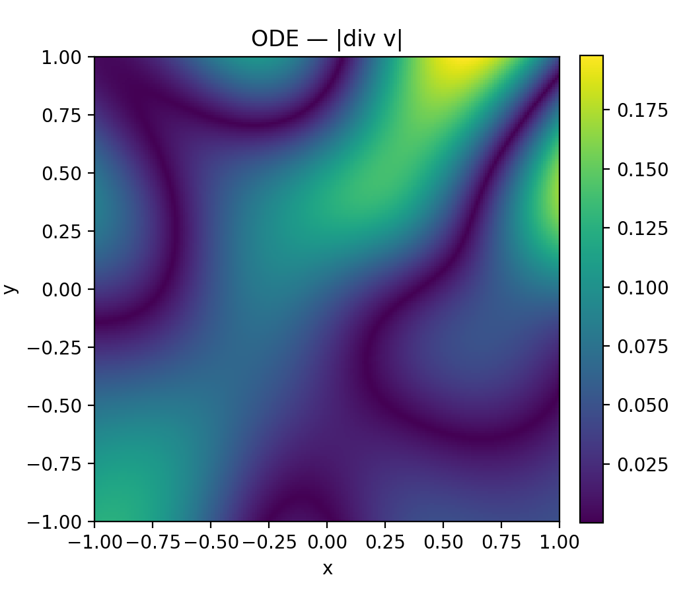
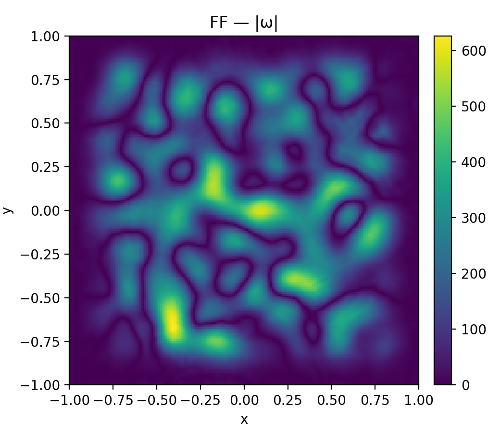
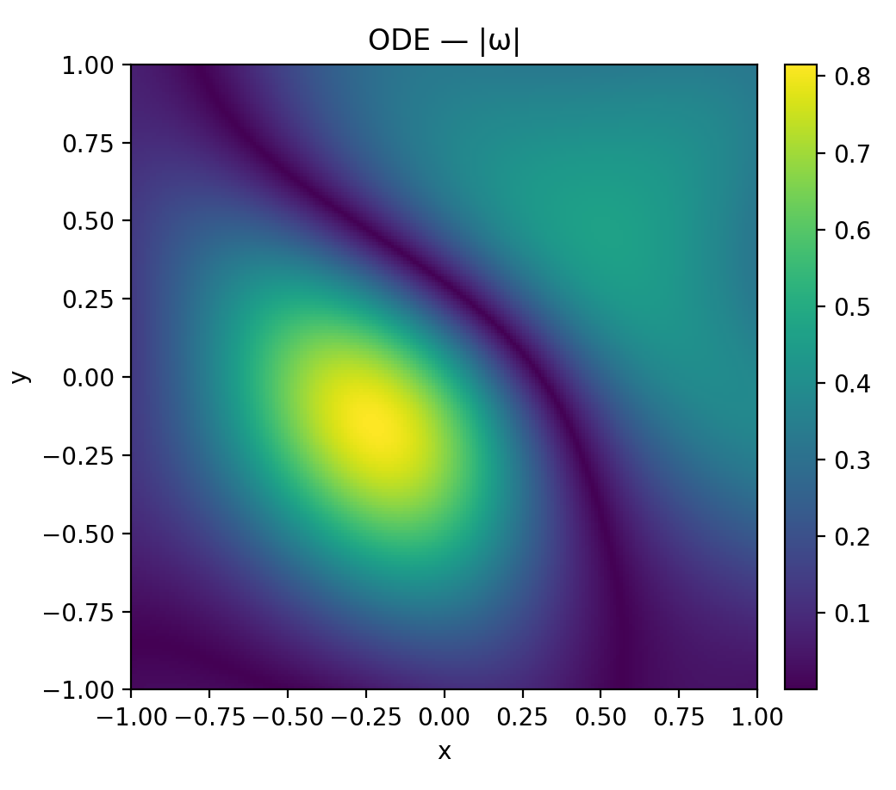
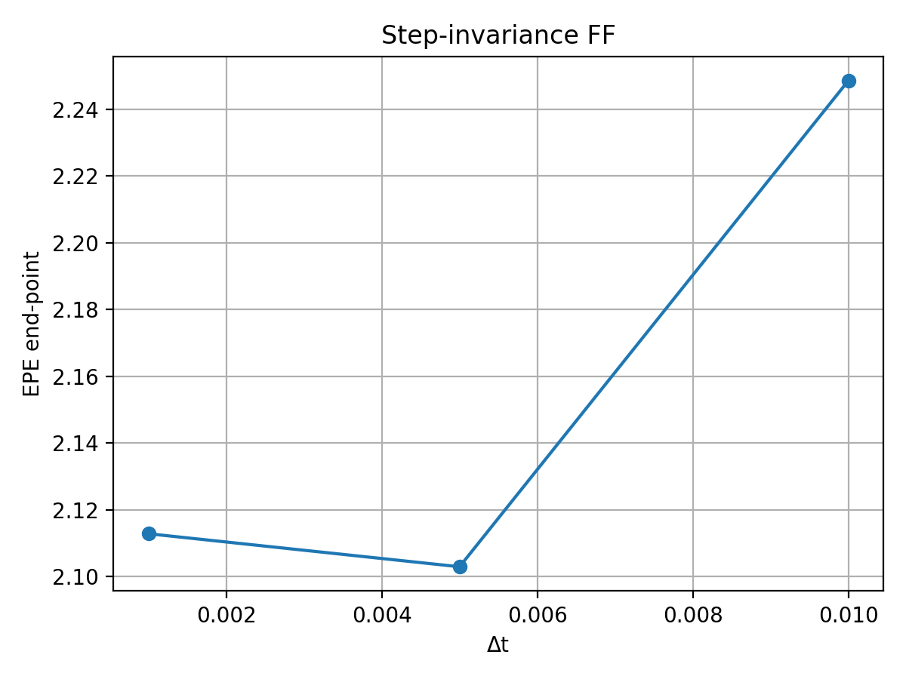
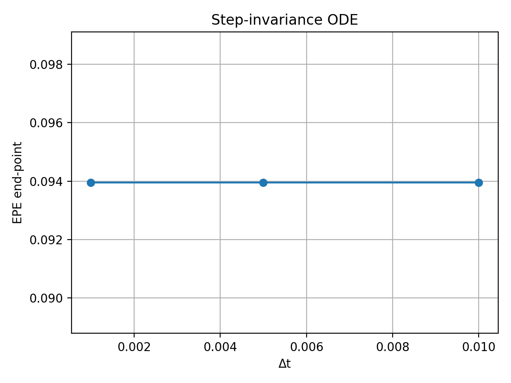

# Neural ODEs for Multi-Vortex Lamb–Oseen Dynamics

This repository investigates how **Neural ODEs (NODE)** and **Augmented Neural ODEs (ANODE)** learn and reproduce the dynamics of particles advected by a **multi-vortex Lamb–Oseen flow**.  
The goal is to compare classic feedforward models with continuous-time neural formulations and evaluate them using physically meaningful metrics.

---

## Overview

We aim to learn the continuous law

$\dot{\mathbf{r}}(t) = \mathbf{v}(\mathbf{r}(t), t)$

where $\mathbf{v}$ is the multi-vortex Lamb–Oseen velocity field.  
Three models are implemented:

- **Feedforward Network (FF)** — discrete mapping $(x,y,t) \to (u_x, u_y)$
- **Neural ODE (NODE)** — learns the differential law directly via `torchdiffeq`  
- **Augmented Neural ODE (ANODE)** — extends the ODE state with latent variables for greater expressiveness  

The evaluation focuses on **physical coherence**, including vorticity, divergence, circulation, step-invariance, and trajectory correctness.


---

## Physical Background

### Lamb–Oseen Vortex
A viscous vortex with tangential velocity:


$v_\theta(r,t) = \frac{\Gamma}{2\pi r}\left(1 - e^{-r^2/(4\nu t)}\right) $

and vorticity:

$\omega(r,t) = \frac{\Gamma}{4\pi\nu t}\exp\!\left(-\frac{r^2}{4\nu t}\right)$

### Multi-Vortex Superposition
The flow field is the linear sum of multiple Lamb–Oseen vortices with different circulations and centers:

$\mathbf{v}(x,t) = \sum_i \mathbf{v}_i(x,t)$

This analytic field is the reference for dataset generation and model evaluation.

---

## Dataset

`dataset.py` generates Lagrangian trajectories by integrating the analytic field using RK4.

- Domain: \([-2, 2]^2\)  
- Time span: typically 51 steps  
- Output:  
  - `r0` initial condition  
  - `t_span` time vector  
  - `r_traj` particle trajectory  

---

## Models

### FeedForward Neural Network

A simple MLP that predicts velocity directly: $(x, y, t) \to (u_x, u_y)$
Fast but not physically reliable.

### Neural Ordinary Differential Equations

Learns a continuous time vector field:
$\dot{\mathbf{r}}(t) = \mathbf{v}(\mathbf{r}(t), t)$
and integrates it via `torchdiffeq.odeint`. The network produces a stable, physically consistent trajectories.

### Augmented Neural Ordinary Differential Equations

Extends the ODE state as follow:

$$ 
\frac{d}{dt}
    \begin{bmatrix}
        r(t) \\
        a(t)
    \end{bmatrix}
    = f\left(
    \begin{bmatrix}
        r(t) \\
        a(t)
    \end{bmatrix}, t
    \right)
$$

where $r(t)$ is the original latent state and $a(t)$ are the added variables and allowing improved modeling of complex dynamics.

---
## Training
Train and save each model with:
```python
python3 neural_ode.py
python3 anode.py
python3 feedforward.py
```

## Full Evaluation
Run
```python
python3 compare_networks.py
```
to get all physics metrics used to compare FF, NODE and ANODE networks. 

---
## Evaluation Metrics

### Velocity Field Error
 

### Divergence field
 
### Vorticity field
 
### Step-Invariance
 

---
## Results Summary

## Dependencies
```python
pip install torch torchdiffeq numpy matplotlib
```


