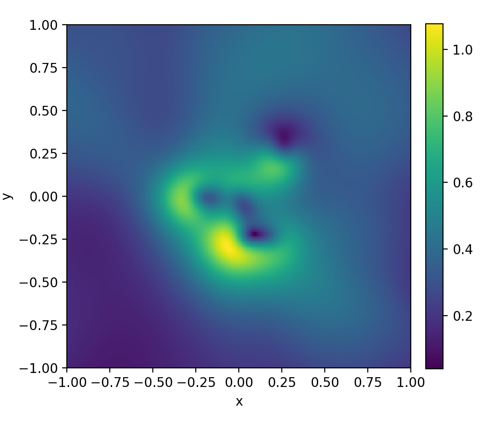
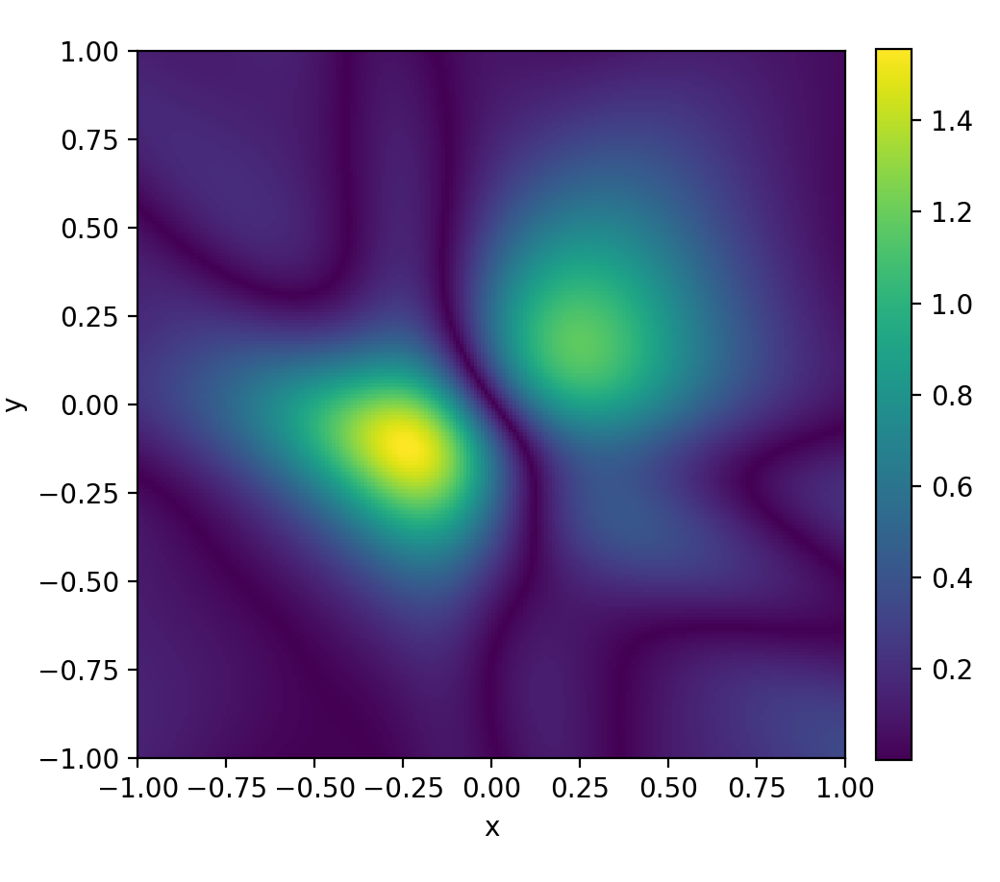
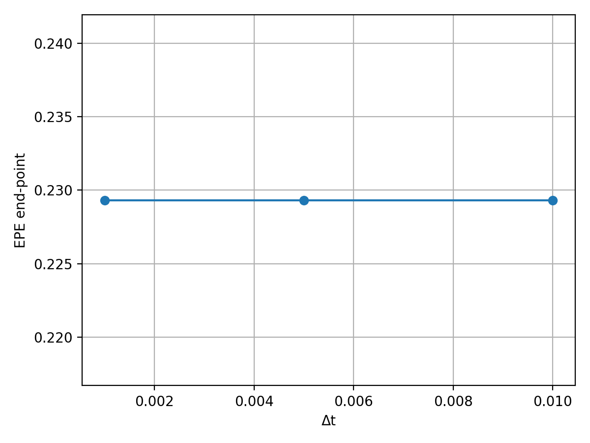

# Neural ODEs for Multi-Vortex Lamb–Oseen Dynamics

This repository investigates how **Neural ODEs (NODE)** and **Augmented Neural ODEs (ANODE)** learn and reproduce the dynamics of particles advected by a **multi-vortex Lamb–Oseen flow**.  
The goal is to compare classic feedforward models with continuous-time neural formulations and evaluate them using physically meaningful metrics.

---

## Overview

We aim to learn the continuous law

$$\dot{\mathbf{r}}(t) = \mathbf{v}(\mathbf{r}(t), t)$$

where $\mathbf{v}$ is the multi-vortex Lamb–Oseen velocity field.  
Three models are implemented:

- **Feedforward Network (FF)** — discrete mapping $(x,y,t) \to (u_x, u_y)$
- **Neural ODE (NODE)** — learns the differential law directly via `torchdiffeq`  
- **Augmented Neural ODE (ANODE)** — extends the ODE state with latent variables for greater expressiveness  

The evaluation focuses on **physical coherence**, including vorticity, divergence, circulation, step-invariance, and trajectory correctness.


---

## Physical Background

### Lamb–Oseen Vortex
A viscous vortex with tangential velocity:


$$v_\theta(r,t) = \frac{\Gamma}{2\pi r}\left(1 - e^{-r^2/(4\nu t)}\right) $$

and vorticity:

$$\omega(r,t) = \frac{\Gamma}{4\pi\nu t}\exp\!\left(-\frac{r^2}{4\nu t}\right)$$

### Multi-Vortex Superposition
The flow field is the linear sum of multiple Lamb–Oseen vortices with different circulations and centers:

$$\mathbf{v}(x,t) = \sum_i \mathbf{v}_i(x,t)$$

This analytic field is the reference for dataset generation and model evaluation.

---

## Dataset

`dataset.py` generates Lagrangian trajectories by integrating the analytic field using RK4.

- Domain: $([-2, 2]x[-2, 2])$  
- Time span: typically 51 steps  
- Output:  
  - `r0` initial condition  
  - `t_span` time vector  
  - `r_traj` particle trajectory  

---

## Models

### FeedForward Neural Network

A simple MLP that predicts velocity directly: $(x, y, t) \to (u_x, u_y)$
Fast but not physically reliable.

### Neural Ordinary Differential Equations

Learns a continuous time vector field:
$\dot{\mathbf{r}}(t) = \mathbf{v}(\mathbf{r}(t), t)$
and integrates it via `torchdiffeq.odeint`. The network produces a stable, physically consistent trajectories.

### Augmented Neural Ordinary Differential Equations

Extends the ODE state as follow:

$$ 
\frac{d}{dt}
    \begin{bmatrix}
        r(t) \\
        a(t)
    \end{bmatrix}
    = f\left(
    \begin{bmatrix}
        r(t) \\
        a(t)
    \end{bmatrix}, t
    \right)
$$

where $r(t)$ is the original latent state and $a(t)$ are the added variables and allowing improved modeling of complex dynamics.

---
## Training
Train and save each model with:
```python
python3 neural_ode.py
python3 anode.py
python3 feedforward.py
```

## Full Evaluation
Run
```python
python3 compare_networks.py
```
to get all physics metrics used to compare FF, NODE and ANODE networks. 

---
## Evaluation Metrics

### Velocity Field Error
The following formula was used to evaluate the error between the predicted field and the actual ,analytical, field:

$$||\Delta v(x, y) || = \sqrt{(v_x^{pred} - v_x^{true})^2 +(v_y^{pred} - v_y^{true})^2}$$

The following graph shows the spatial map of the error on the velocity field, i.e. how well the model replicates the real field. 
On the left, the vector field error of the FeedForward model; on the right, calculated with Neural ODE and Augmented Neural ODE:

  
The Neural ODE learned the global structure of the flow, showing a regular field consistent with the physics of the flow.
The FeedForward network, on the other hand, shows errors that are orders of magnitude greater than those of the Neural ODE.

### Divergence field
In this case, we calculate the divergence of the velocity field:


$$\mid \nabla \cdot v(x, y) \mid = \mid \frac{\partial v_x}{\partial x} + \frac{\partial v_y}{\partial y} \mid$$


The fluid we are evaluating is incompressible and therefore its divergence must be zero.

On the left, the divergence module calculated with the Feed Forward network; on the right, calculated with the Neural ODE.
<br>
  


The Neural ODE has an almost zero divergence across the entire domain considered. It also reproduces a smooth and continuous field, where the spatial derivatives vary regularly. 

The FeedForward network has very high divergence values. We also note patterns with high values distributed chaotically across the entire domain. 

### Vorticity field 
  


The Neural ODE represents a clear vortex structure, with a peak of vorticity in the centre and a radial decay, as predicted by theory.

The FeedForward network shows chaotic behaviour that is totally physically inconsistent. We find areas of vorticity explosion and no radial and symmetrical structure. 

### Step-Invariance
Ideally, for physical consistency, we would like to have a result that is as independent as possible from the time step. 
To quantify this metric, we calculate the END-POINT-ERROR:

$$EPE(\Delta t) = \frac{1}{N} \sum_{i=1}^{N} {||r_i^{pred}(T, \Delta t) - r_i^{true}(T)||_2}$$

We are evaluating the end point based on the time step. 

On the left, the Feed Forward network; on the right, the Neural ODE network:
<br>

  


The Neural ODE has a virtually unchanged EPE for the time steps considered. The numerical trajectory is convergent and the error depends only on the capacity of the model and not on the numerical step. It is convenient to use a larger $\Delta t$ without compromising the accuracy of my physical simulations. 

The Feed Forward network does not maintain spatial consistency. The trajectories differ depending on the time step considered; this means that the model does not define a well-posed equation of motion. 

---
## Results Summary
The physical law considered show a significant difference between the two networks. The Neural ODEs maintain consistency, while the Feed Forward behaves almost randomly. The physical consistency of Neural ODEs was easily deduced. The fluid flow must comply with certain local geometric constraints, such as incompressibility, temporal continuity, and rotational regularity. 

Neural ODEs have been trained to learn a continuous flow over time, and the physics behind this algorithm emerges because it is a direct mathematical consequence of the differential laws learned. The Feed Forward network, on the other hand, learns the field point by point and is not bounded to these constraints. 

Neural ODEs can in fact represent an effective compromise, overcoming the black-box nature of classic networks while speeding up numerical methods.

## Dependencies
```python
pip install torch torchdiffeq numpy matplotlib
```

---
## Next Steps
- Integrate PINNs losses
- Experiment with Neural ODEs as surrogate of 2D Navier-Stokes solvers
- Extend to 3D domain


